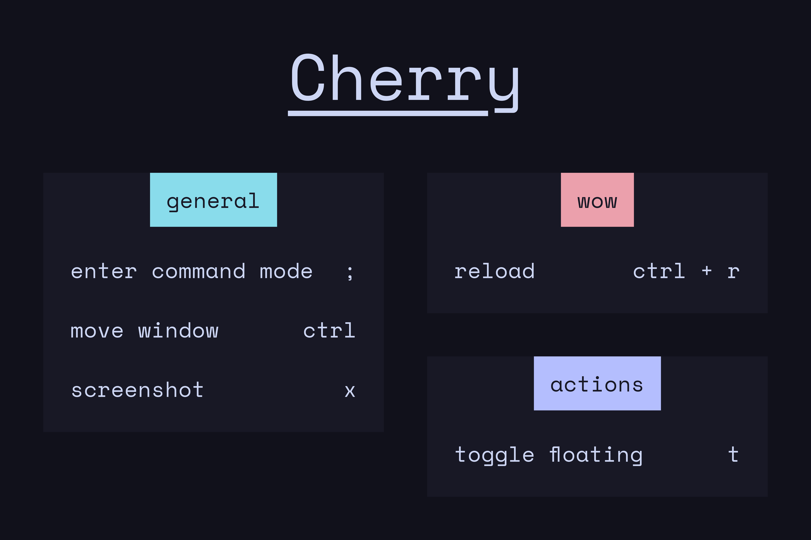

<div align="center">

```ocaml
Cherry
```


<samp>Generate beautiful keybind cheatsheets</samp>

---
<div align="left">

> Note: This project is in early stages, it does work but could do with more configuration and QoL

## <samp> I. Setup </samp>
Clone and install dependancies
```console
git clone https://github.com/ahmedmahmud/cherry
cd cherry
npm i
```
## <samp> II. Usage </samp>
Setup a `JSON` file with your configuration, example one provided in `options.json`.

Run the script with the path to the `JSON` file
```console
npm start <path_to_config_json>
```
It will create an `output.png` with your cheatsheet image

---
## <samp> Credits </samp>
This was project was inspired by [NvChad's](https://nvchad.com/) cheatsheet and is an attempt at making a general utility for such cheatsheets.

---
## <samp> Future plans </samp>
- [ ] Package into a binary somehow
    - May need a port away from node?
    - Speed increase would be nice
- [ ] More colorschemes
    - [ ] Custom colorschemes
- [ ] More fonts
    - [ ] Custom fonts
- [ ] Configure font sizes
- [ ] Configure spacing/gaps
- [ ] Add default options, overwrite with specific options
- [ ] Add more styles
    - Maybe modular styling such as:
        - Card styles
            - Corner radius
            - Borders
            - Transparency & Blur
            - Image/gradient backgrounds
            - Drop shadows
            - Title bar styles
        - Sheet styles
            - Image/gradient backgrouns
            - Frames/borders

> *Most of these style options can easily be hacked in if you know a bit of web design. I chose tailwind for its ease-of-use and great documentation*


<p align="center"></p>
<p align="center"><a href="https://github.com/ahmedmahmud/cherry/blob/master/LICENSE"></a></p>